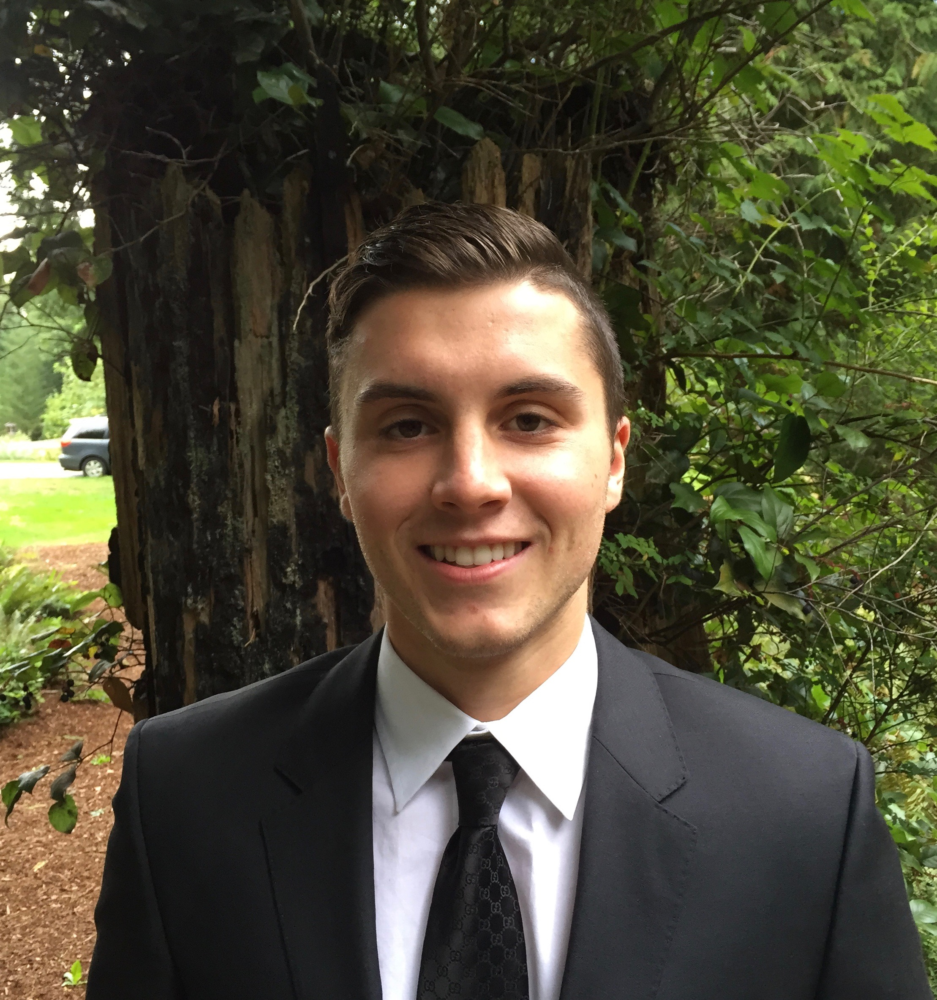

### About

I am a second year M.S. Biostatistics student within the Mailman School of Public Health at Columbia University. I also work part-time in a graduate data scientist co-op role at Novo Nordisk working on some cool projects with Non-Alcoholic Steatohepatitis.

Outside of working with numbers, I love playing and watching nearly every sport imaginable. I am a big time Seattle sports fan and I'm looking forward to the Seahawks winning the Super Bowl this year.

You can check out my resume [here](resume.html).